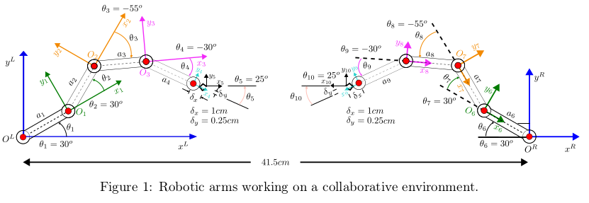

# Robotics homework

Robotics homework about 2 collaborative robots

# Introduction

Given 2 collaborative robots, calculate the end effector final position.

$$
a1 = a2 = a3 = a4 = a5 = a6 = a7 = a8 = a9 = 4cm
$$

# Check list

- [ ] Find $T_5^L$
- [ ] Find final position of left arm's effector with respect with left arm's origin
- [ ] Find $T_5^R$
- [ ] Find final position of right arm's effector with respect with the right arm's origin
- [ ] Find $T_L^R$ (Position from the Right in respect of position from the left)
- [ ] Find final position of right arm origin with respect to the left
- [ ] Make a technical report with the procedure
- [ ] Add conclusions to the report

# For developers

...
